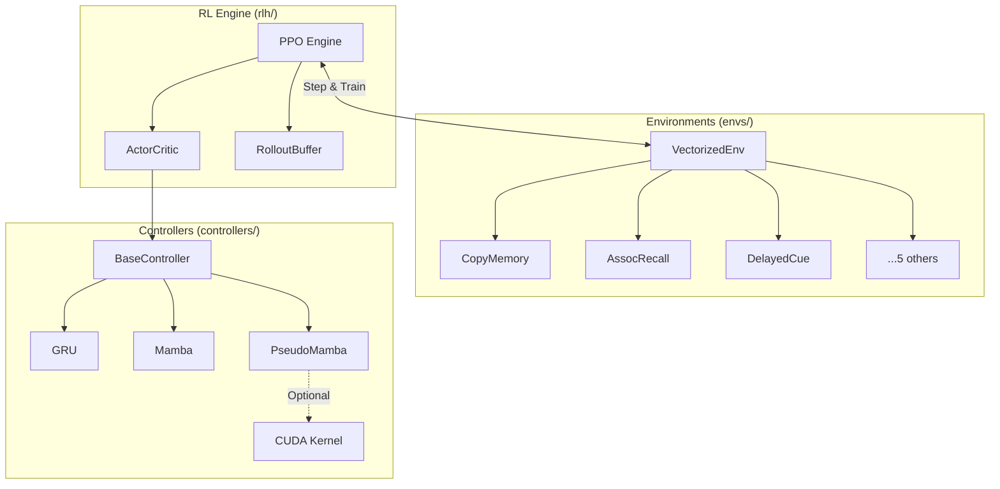

# Pseudo-Mamba v2.0 System Overview

## Architecture

The Pseudo-Mamba system is designed for rigorous evaluation of long-horizon memory capabilities in recurrent neural networks and state space models.

### System Architecture



### Core Components

1.  **Controllers (`pseudo_mamba.controllers`)**:
    *   **Unified API**: All controllers inherit from `BaseController` and expose a consistent `forward_step(x, state) -> (features, new_state)` interface.
    *   **Implementations**:
        *   `GRUController`: Standard Gated Recurrent Unit.
        *   `MambaController`: Wrapper around `mamba_ssm` with explicit state management.
        *   `PseudoMambaController`: Minimal SSM implementation using a custom CUDA kernel (`y = tanh(x + h)`).

2.  **Environments (`pseudo_mamba.envs`)**:
    *   **Vectorized Suite**: 8 memory-intensive tasks implemented in PyTorch for massive parallelism.
    *   **Tasks**: `DelayedCue`, `CopyMemory`, `AssocRecall`, `NBack`, `MultiCueDelay`, `PermutedCopy`, `PatternBinding`, `DistractorNav`.

3.  **RL Engine (`pseudo_mamba.rlh`)**:
    *   **Honest PPO**: Implements Proximal Policy Optimization with full-sequence Backpropagation Through Time (BPTT).
    *   **Recurrent Support**: Correctly handles hidden state preservation and masking across rollout chunks.

4.  **Kernels (`pseudo_mamba.kernels`)**:
    *   **CUDA Extension**: Custom C++/CUDA kernels for efficient SSM operations.
    *   **Scaffold**: Robust setup scripts and correctness tests.

## Usage

### Running Benchmarks

```bash
python -m pseudo_mamba.benchmarks.benchmark_runner \
    --task copy_memory \
    --controller mamba \
    --num_envs 64 \
    --total_updates 1000
```

### Running Tests

```bash
bash scripts/test_all.sh
```
